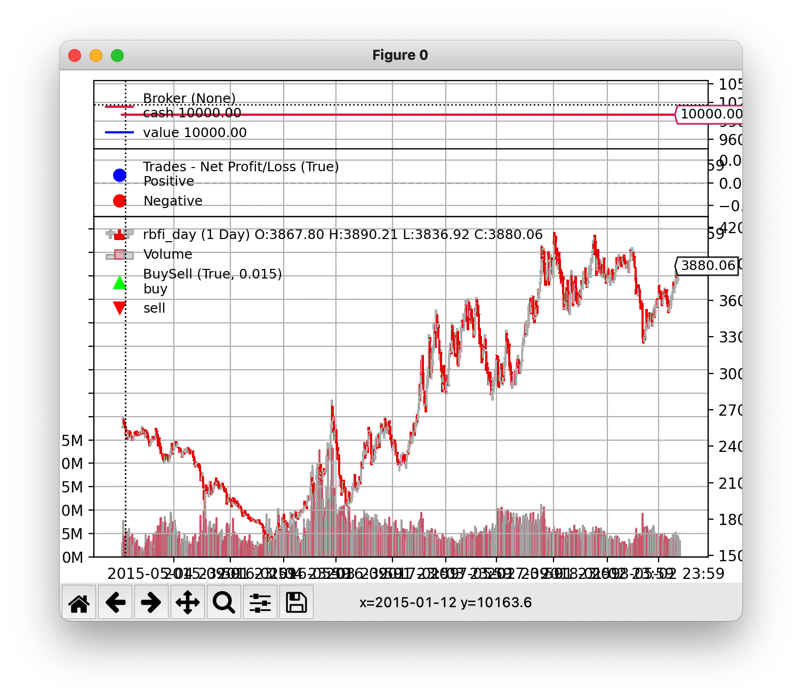
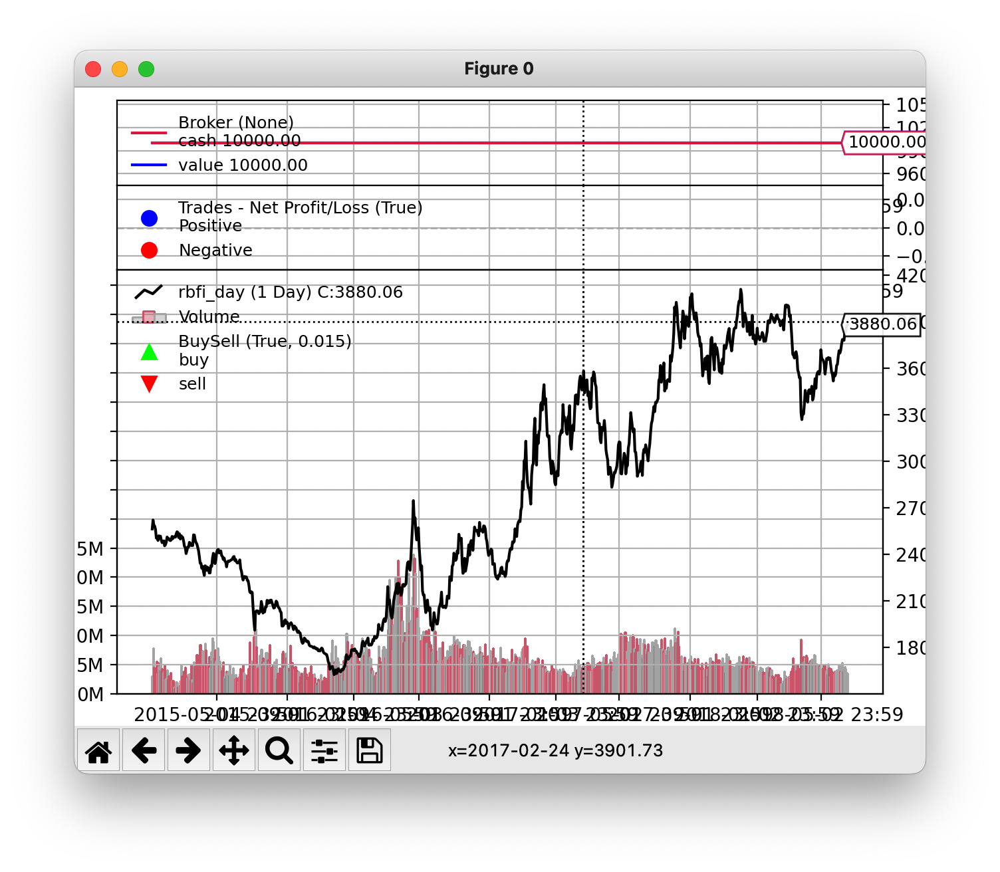

```python
import backtrader as bt
import pandas as pd
import datetime


class MyStrategy(bt.Strategy):
    pass


cerebro = bt.Cerebro()

# 读取数据的方法1
# df = pd.read_csv('data/rbfi_day.csv')
# df['datetime'] = pd.to_datetime(df['datetime'])
# df.set_index('datetime', inplace=True)
# df['openinterest'] = 0
# # 注 能用pandas的地方尽量用pandas
# # 将pandas的dateframe转换成cerebro能识别的数据形式
# brf_daily = bt.feeds.PandasData(
#     dataname=df,
#     fromdate=datetime.datetime(2017, 5, 13),
#     todate=datetime.datetime(2017, 6, 20)
# )

# 读取数据的方法2（不借用pandas）
brf_daily = bt.feeds.GenericCSVData(
    dataname='data/rbfi_day.csv',
    # 如果不显式指定fromdate和todate，那么数据集为全csv范围
    # fromdate=datetime.datetime(2017, 1, 1),
    # todate=datetime.datetime(2017, 12, 31),
    nullvalue=0.0,  # csv中存在缺失值，那么用该值填充
    dtformat=('%Y/%m/%d'),
    datetime=0,  # datetime是第1列的colume name
    high=2,
    low=3,
    open=1,
    close=4,
    volume=5,
    openinterest=-1  # -1表示csv文件中不包含openinterest列
)

cerebro.adddata(brf_daily)

cerebro.addstrategy(MyStrategy)

cerebro.run()

# 绘制出的曲线为黑线
# cerebro.plot() 
# 曲线为蜡烛图
cerebro.plot(style='candle')
```



plot不带candle参数：



注：在绘制的图像中可以使用🔍进行图像的放大。点击将视图恢复至原始视图。