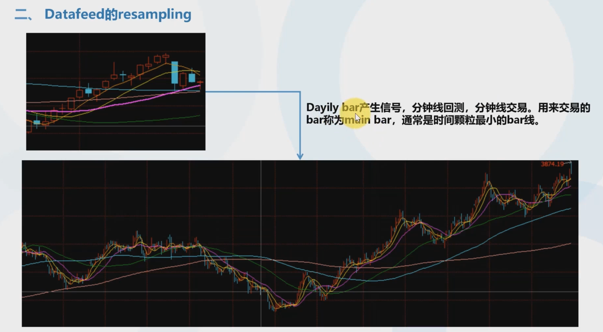

## 03. 第三章：Dual Thrust和策略优化

### 1. Dual Thrust策略的讲解





timeframe参数是告诉backtrader这个数据集是分钟级别的。

然后cerebro.resampledata()是将分钟级别的数据resample成其他频率的数据并添加到cerebro中。

### 2. datafeed的resampling

```python
cerebro = bt.Cerebro()

df = pd.read_csv('data/rbfi_min.csv')
df['datetime'] = pd.to_datetime(df['datetime'])
df.set_index('datetime', inplace=True)
df['openinterest'] = 0

# 数据集标记为Minutes
brf_min_bar = bt.feeds.PandasData(
    dataname=df,
    fromdate=datetime.datetime(2018, 5, 22),
    todate=datetime.datetime(2018, 6, 22),
    timeframe=bt.TimeFrame.Minutes
)

cerebro.adddata(brf_min_bar)
# 分钟线resample成日线
cerebro.resampledata(brf_min_bar, timeframe=bt.TimeFrame.Days)

# cerebro.addstrategy(MyStrategy)

cerebro.run()

cerebro.plot()
```


注：self.data0是分钟级数据（main datafeed），而resample后的小时级数据是self.data1。

### 3. Dual Thrust策略的实现


先明确DT指标由两个lines（上下轨）和三个参数构成（n日period，上下轨间的range的两个系数k）。

整个日内策略如下：

```python
class DualThrust(bt.Indicator):
    lines = ('up', 'down')
    params = (
        ('period', 2),
        ('k_up', 0.7),
        ('k_down', 0.7)
    )

    def __init__(self):
        self.addminperiod(self.p.period + 1)

    def next(self):
        HH = max(self.data.high.get(-1, size=self.p.period))
        LC = min(self.data.close.get(-1, size=self.p.period))
        HC = max(self.data.close.get(-1, size=self.p.period))
        LL = min(self.data.low.get(-1, size=self.p.period))
        R = max(HH - LC, HC - LL)
        # 上轨
        self.lines.up[0] = self.data.open[0] + self.p.k_up * R
        # 下轨
        self.lines.down[0] = self.data.open[0] - self.p.k_down * R


class MyStrategy(bt.Strategy):
    def __init__(self):
        # 使用resample后的日级数据
        self.dt = DualThrust(self.data1)
        # tips：self.dt是日级数据，通过调用自己同名的方法，backtrader将自动将其转化成同main data
        # 相同的颗粒度——即：日级数据1个，扩充为24*60个相同的数据（与data0升级到同维）
        self.dt = self.dt()
        # 不单独绘制dl图
        # self.dt.plotinfo.plot = False
        # 在分钟级数据
        self.dt.plotinfo.plotmaster = self.data

        self.buy_signal = bt.indicators.CrossUp(self.data.close, self.dt.up)
        self.sell_signal = bt.indicators.CrossDown(self.data.close, self.dt.down)

    def next(self):
        # 每日9:03~22:55之间才开始做单（定义日内交易）
        if self.data.datetime.time() > datetime.time(9, 3) and self.data.datetime.time() < datetime.time(22, 55):
            if not self.position and self.buy_signal[0] == 1:
                self.order = self.buy()
            if not self.position and self.sell_signal[0] == 1:
                self.order = self.sell()

            if self.getposition().size < 0 and self.buy_signal[0] == 1:
                self.order = self.close()
                self.order = self.buy()

            if self.getposition().size > 0 and self.sell_signal[0] == 1:
                self.order = self.close()
                self.order = self.sell()

        # 如果到了22：55及其之后（尾盘），并且有持仓。那么平仓，即如果当日到了尾盘仍有仓位，必须平仓
        
        if self.data.datetime.time() >= datetime.time(22, 55) and self.position:
            self.order = self.close()


cerebro = bt.Cerebro()

df = pd.read_csv('data/rbfi_min.csv')
df['datetime'] = pd.to_datetime(df['datetime'])
df.set_index('datetime', inplace=True)
df['openinterest'] = 0

brf_min_bar = bt.feeds.PandasData(
    dataname=df,
    fromdate=datetime.datetime(2018, 5, 22),
    todate=datetime.datetime(2018, 6, 22),
    timeframe=bt.TimeFrame.Minutes
)

cerebro.adddata(brf_min_bar)
# 分钟线resample成日线
cerebro.resampledata(brf_min_bar, timeframe=bt.TimeFrame.Days)

cerebro.addstrategy(MyStrategy)

cerebro.run()

cerebro.plot(style='candle')
```

### 4. 策略优化器的使用


防止过拟合：要设置样本内和样本外数据进行回测，两个数据集中的表现差不多，则可以认为未发生过拟合。

backtrader的优化器是多线程在跑。注意在使用优化器时cpu使用率会暴涨，

```python
import backtrader as bt
import pandas as pd
import datetime


class DualThrust(bt.Indicator):
    lines = ('up', 'down')
    params = (
        ('period', 2),
        ('k_up', 0.7),
        ('k_down', 0.7)
    )

    def __init__(self):
        self.addminperiod(self.p.period + 1)

    def next(self):
        HH = max(self.data.high.get(-1, size=self.p.period))
        LC = min(self.data.close.get(-1, size=self.p.period))
        HC = max(self.data.close.get(-1, size=self.p.period))
        LL = min(self.data.low.get(-1, size=self.p.period))
        R = max(HH - LC, HC - LL)
        # 上轨
        self.lines.up[0] = self.data.open[0] + self.p.k_up * R
        # 下轨
        self.lines.down[0] = self.data.open[0] - self.p.k_down * R


class MyStrategy(bt.Strategy):
    params = (
        ('period', 2),
        ('k_up', 0.7),
        ('k_down', 0.7)
    )

    def __init__(self):
        # 使用resample后的日级数据，将参数传给indicator
        self.dt = DualThrust(self.data1, period=self.p.period, k_up=self.p.k_up, k_down=self.p.k_down)
        # tips：self.dt是日级数据，通过调用自己同名的方法，backtrader将自动将其转化成同main data
        # 相同的颗粒度——即：日级数据1个，扩充为24*60个相同的数据（与data0升级到同维）
        self.dt = self.dt()
        # 不单独绘制dl图
        # self.dt.plotinfo.plot = False
        # 在分钟级数据
        self.dt.plotinfo.plotmaster = self.data

        self.buy_signal = bt.indicators.CrossUp(self.data.close, self.dt.up)
        self.sell_signal = bt.indicators.CrossDown(self.data.close, self.dt.down)

    def next(self):
        # 每日9:03~22:55之间才开始做单（定义日内交易）
        if self.data.datetime.time() > datetime.time(9, 3) and self.data.datetime.time() < datetime.time(22, 55):
            if not self.position and self.buy_signal[0] == 1:
                self.order = self.buy()
            if not self.position and self.sell_signal[0] == 1:
                self.order = self.sell()

            if self.getposition().size < 0 and self.buy_signal[0] == 1:
                self.order = self.close()
                self.order = self.buy()

            if self.getposition().size > 0 and self.sell_signal[0] == 1:
                self.order = self.close()
                self.order = self.sell()

        # 如果到了22：55及其之后（尾盘），并且有持仓。那么平仓
        if self.data.datetime.time() >= datetime.time(22, 55) and self.position:
            self.order = self.close()

    def stop(self):
        # 在每次策略结束时，打印相关参数的策略的最终净值
        print('period: %s, k_up: %s, k_down: %s, final_value: %.2f' % (
            self.p.period, self.p.k_up, self.p.k_down, self.broker.getvalue()))


def main():
    cerebro = bt.Cerebro()

    df = pd.read_csv('data/rbfi_min.csv')
    df['datetime'] = pd.to_datetime(df['datetime'])
    df.set_index('datetime', inplace=True)
    df['openinterest'] = 0

    brf_min_bar = bt.feeds.PandasData(
        dataname=df,
        fromdate=datetime.datetime(2018, 5, 22),
        todate=datetime.datetime(2018, 6, 22),
        timeframe=bt.TimeFrame.Minutes
    )

    cerebro.adddata(brf_min_bar)
    # 分钟线resample成日线
    cerebro.resampledata(brf_min_bar, timeframe=bt.TimeFrame.Days)

    # 设置优化器
    cerebro.optstrategy(
        MyStrategy,
        period=range(1, 5),
        k_up=[n / 10.0 for n in range(2, 10)],
        k_down=[n / 10.0 for n in range(2, 10)]
    )

    cerebro.run()

    # 使用优化器时就不要进行plot的了
    # cerebro.plot(style='candle')


if __name__ == '__main__':
    main()
```

注：使用优化器时要开启多线程，那么一定要将主函数逻辑封装在一个函数中（上面是def main()），然后如下调用：

```python
if __name__ == '__main__':
    main()
```

否则会出现如下报错：


