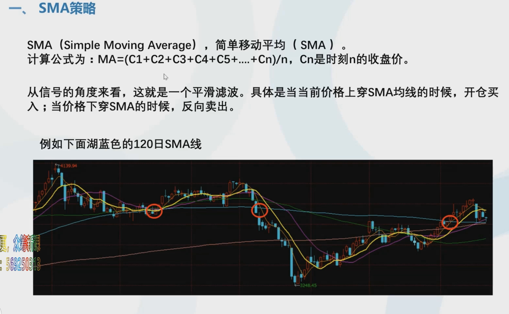
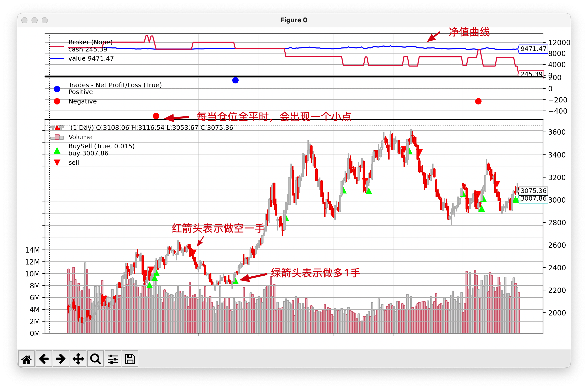
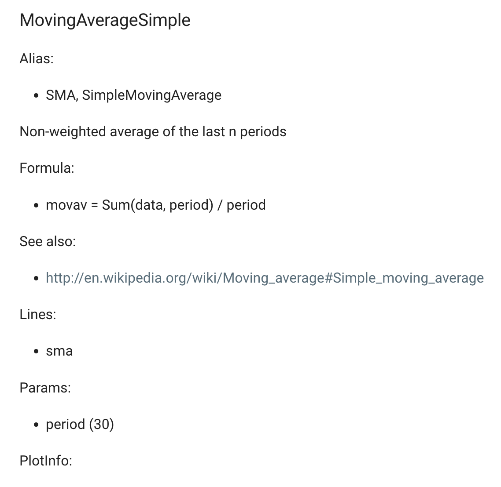
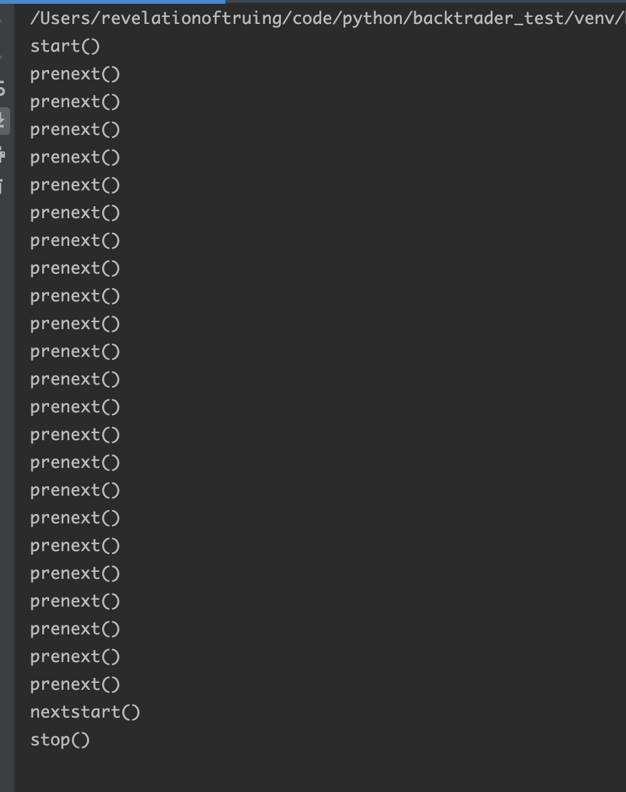
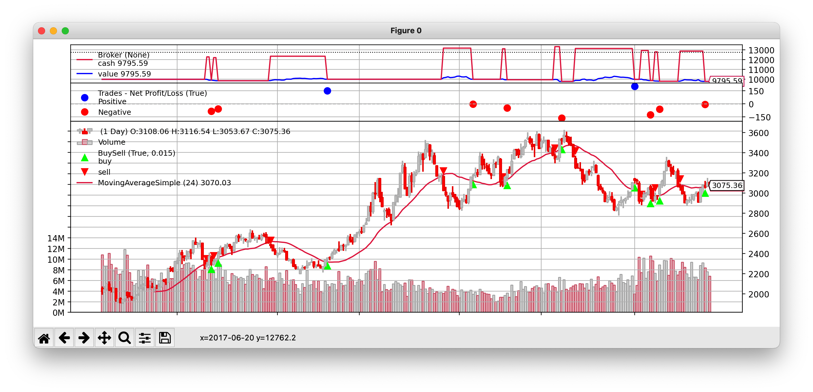
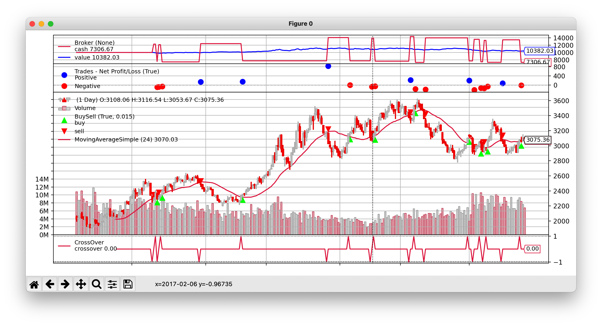

## 第二章 Indicator的使用和SMA策略

### 1. SMA策略与backtrader的line操作



```python
import backtrader as bt
import pandas as pd
import datetime


class MyStrategy(bt.Strategy):
    def __init__(self):
        print('__init__()')

    def start(self):
        print('start()')

    def prenext(self):
        print('prenext()')

    def nextstart(self):
        print('nextstart()')

    def next(self):
        # print(self.data.close[0], self.data.close[-1], self.data.close[-2])
        ma_value = sum([self.data.close[-i] for i in range(0, 24)]) / 24
        if self.data.close[0] > ma_value > self.data.close[-1]:
            print('long')
            # 打印本bar的时间
            print(self.data.datetime.date())
            # 做多一手
            self.order = self.buy(size=1)
        if self.data.close[0] < ma_value < self.data.close[-1]:
            # 做空一手
            self.order = self.sell(size=1)

    def stop(self):
        print('stop()')


cerebro = bt.Cerebro()

df = pd.read_csv('data/rbfi_day.csv')
df['datetime'] = pd.to_datetime(df['datetime'])
df.set_index('datetime', inplace=True)
df['openinterest'] = 0
brf_daily = bt.feeds.PandasData(
    dataname=df,
    fromdate=datetime.datetime(2016, 5, 13),
    todate=datetime.datetime(2017, 6, 20)
)


cerebro.adddata(brf_daily)

cerebro.addstrategy(MyStrategy)

cerebro.run()

cerebro.plot(style='candle')
```



### 2. SMA Indicator的使用

backtrader中自带的指标库文档：

https://www.backtrader.com/docu/indautoref/



```python
class MyStrategy(bt.Strategy):
    def __init__(self):
        # 利用datas[0]数据来绘制sma曲线
        self.bt_sma = bt.indicators.MovingAverageSimple(self.data, period=24)

    def start(self):
        print('start()')

    def prenext(self):
        print('prenext()')

    def nextstart(self):
        print('nextstart()')

    def next(self):
        ma_value = self.bt_sma[0]
        pre_ma_value = self.bt_sma[-1]
        if self.data.close[0] > ma_value and self.data.close[-1] <= pre_ma_value:
            # 做多一手
            self.order = self.buy(size=1)
        if self.data.close[0] < ma_value and self.data.close[-1] >= pre_ma_value:
            # 做空一手
            self.order = self.sell(size=1)

    def stop(self):
        print('stop()')
```

打印：



由于是24日均线所以之前有23根bar没有办法形成sma，所以打印结果里有23个prenext()，即前23根bar上不运行next()，而运行prenext()。



优化： 金叉死叉更高级的写法

```python
class MyStrategy(bt.Strategy):
    def __init__(self):
        # 利用datas[0]数据来绘制sma曲线
        self.bt_sma = bt.indicators.MovingAverageSimple(self.data, period=24)
        # 更高级的金叉死叉的写法
        # close上穿sma返回1，下穿返回-1，不穿返回0
        self.buy_sell_signal = bt.indicators.CrossOver(self.data.close, self.bt_sma)

    def start(self):
        print('start()')

    def prenext(self):
        print('prenext()')

    def nextstart(self):
        print('nextstart()')

    def next(self):
        # close上穿sma
        if self.buy_sell_signal[0] == 1:
            self.order = self.buy()
        if self.buy_sell_signal[0] == -1:
            self.order = self.sell()

    def stop(self):
        print('stop()')
```


可见，使用crossover函数，最下边多了一行crossover的指示图。

思路：**使用backtrader关于技术指标的形成尽量都放在`__init__`函数中，而在next函数中尽量做信号的判断。**

上图有个问题，净值曲线在整个时间轴上有很长一部分时间保持不变（即空仓状态）。这是因为我们的策略在金叉后出现死叉，直接卖一手而平仓了。而我们的真实想法是，金叉后出现死叉时，我们要平仓，并且开新的空仓。这里就需要加入仓位判断了：

```python
class MyStrategy(bt.Strategy):
    def __init__(self):
        # 利用datas[0]数据来绘制sma曲线
        self.bt_sma = bt.indicators.MovingAverageSimple(self.data, period=24)
        # 更高级的金叉死叉的写法
        # close上穿sma返回1，下穿返回-1，不穿返回0
        self.buy_sell_signal = bt.indicators.CrossOver(self.data.close, self.bt_sma)

    def start(self):
        print('start()')

    def prenext(self):
        print('prenext()')

    def nextstart(self):
        print('nextstart()')

    def next(self):
        # 如果此时没有仓位并且close上穿sma
        if not self.position and self.buy_sell_signal[0] == 1:
            self.order = self.buy()
        # 如果此时没有仓位并且close下穿sma
        if not self.position and self.buy_sell_signal[0] == -1:
            self.order = self.sell()

        # 如果此时有仓位并且close上穿sma
        if self.position and self.buy_sell_signal[0] == 1:
            self.order = self.close()  # 清掉仓位
            self.order = self.buy()  # 转为多头
        # 如果此时有仓位并且close下穿sma
        if self.position and self.buy_sell_signal[0] == -1:
            self.order = self.close()  # 清掉仓位
            self.order = self.sell()  # 转为空头

    def stop(self):
        print('stop()')
```



此时全程都是有仓位的。

注：**以后在写策略的时候，当信号产生时要考虑：当前有仓位的时候怎么做，当前无仓位的时候怎么做。**