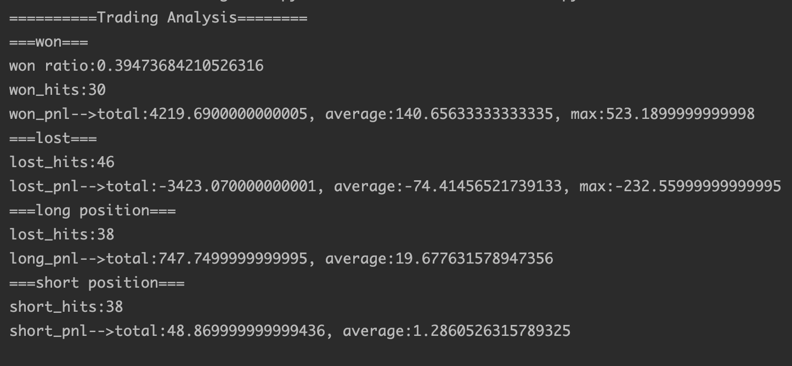

## 第五章 策略结果分析和评价

### 1. Observer与Analyzer

#### 1.1 Observer


如果我们不手动添加任何observers，那么backtrader会默认添加bt.observers.Broker/bt.observers.Trades和bt.observers.BuySell。

注：bt.observers.Broker会自动包含cash和value两种信息，一般我们都只关注value，那么可以只添加bt.observers.Value这个observers即可。

如何关闭默认添加的observers？

```python
cerebro = bt.Cerebro(stdstats=False)
```

其他observer：https://backtrader.com/docu/observers-reference/

```python
# 关闭默认添加的observers
cerebro = bt.Cerebro(stdstats=False)
# 资产净值
cerebro.addobserver(bt.observers.Value)
# 平仓信号点标记
cerebro.addobserver(bt.observers.Trades)
# 交易点位标记
cerebro.addobserver(bt.observers.BuySell)
# 净值曲线的回撤(往往不在observer里面观察回撤，而是在analyzer中)
cerebro.addobserver(bt.observers.DrawDown)
# 持仓每日带来的收益
cerebro.addobserver(bt.observers.TimeReturn)

# 读取数据的方法1
df = pd.read_csv('data/rbfi_day.csv')
df['datetime'] = pd.to_datetime(df['datetime'])
df.set_index('datetime', inplace=True)
df['openinterest'] = 0
# 注 能用pandas的地方尽量用pandas
# 将pandas的dateframe转换成cerebro能识别的数据形式
brf_daily = bt.feeds.PandasData(
    dataname=df,
    fromdate=datetime.datetime(2015, 5, 13),
    todate=datetime.datetime(2017, 6, 20)
)

# 添加datafeed时指定name
cerebro.adddata(brf_daily, name='brf')

cerebro.addstrategy(MyStrategy)

cerebro.run()

# 查看仓位信息
pos = cerebro.broker.getposition(brf_daily)

print(f'持仓大小: {pos.size}')
print(f'持仓均价: {pos.price}')
print(f'资产净值: {cerebro.broker.get_value()}')
print(f'可用现金: {cerebro.broker.get_cash()}')

# 曲线为蜡烛图
cerebro.plot(style='candle')

```


#### 1.2 Analyzer

策略结束后会得到一个值，可以理解为是一个参考指标。


```python
cerebro = bt.Cerebro()

df = pd.read_csv('data/rbfi_day.csv')
df['datetime'] = pd.to_datetime(df['datetime'])
df.set_index('datetime', inplace=True)
df['openinterest'] = 0

brf_daily = bt.feeds.PandasData(
    dataname=df,
    fromdate=datetime.datetime(2015, 5, 13),
    todate=datetime.datetime(2017, 6, 20)
)

cerebro.adddata(brf_daily, name='brf')

cerebro.addstrategy(MyStrategy)

# 添加analyzer
cerebro.addanalyzer(bt.analyzers.DrawDown)
# 可以自定义analyzers名称（改为hello）
cerebro.addanalyzer(bt.analyzers.DrawDown, _name='hello')
# cerebro.addanalyzer(bt.analyzers.SharpeRatio)
# cerebro.addanalyzer(bt.analyzers.TradeAnalyzer)
# cerebro.addanalyzer(bt.analyzers.Transactions)

# cerebro.run()方法的返回值就是analyzer的结果
# 为什么是[0]，因为backtrader支持多策略。当只有一个策略时，[0]就是该策略对应的analyzer的结果
res = cerebro.run()[0]

# 查看analyzer的结果
print('DrawDown:', res.analyzers.drawdown.get_analysis())
# 利用改后的名字hello来查看analyzer的结果
print('DrawDown:', res.analyzers.hello.get_analysis())
# print('SharpeRatio:', res.analyzers.sharperatio.get_analysis())
# print('TradeAnalyzer:', res.analyzers.tradeAnalyzer.get_analysis())
# print('Transactions:', res.analyzers.transactions.get_analysis())

# 曲线为蜡烛图
cerebro.plot(style='candle')
```

看一下drawdown的结果：

```json
DrawDown: AutoOrderedDict(
  [
    ('len', 101),
    // 策略截止时的回撤。如果策略截止时净值创新高，那么drawdown和moneydown都是0
    // 策略结束时，9.36%，金额为1118.22
    ('drawdown', 9.367805884974567), 
    ('moneydown', 1118.2199999999975),
    // 最大回撤
    ('max', AutoOrderedDict([
      ('len', 159), 
      ('drawdown', 10.2471005726809), 
      ('moneydown', 1223.180000000002)])
    )
  ]
)
```

整个DrawDown结果是个字典，可以通过key往外提相关数据：

```python
drawdownData = res.analyzers.drawdown.get_analysis()
print('========== Draw Down ==========')
print('max drawdown: %s %%' % drawdownData['max']['drawdown'])
print('max money drawdown: %s %%' % drawdownData['max']['moneydown'])
```


看一下trade analyzer：很有用的analyzer

```python
...
cerebro.addanalyzer(bt.analyzers.TradeAnalyzer)
res = cerebro.run()[0]
print('TradeAnalyzer:', res.analyzers.tradeanalyzer.get_analysis())
```

输出结果：

```json
TradeAnalyzer: AutoOrderedDict(
  [
   // 策略的开单次数，一共开了77次单，目前有76笔已经平掉了，还剩1个单子是开着的
   ('total', AutoOrderedDict([('total', 77), ('open', 1), ('closed', 76)])),
    // 最大连续获胜3次及最大连续失败4次（没啥用的统计，不看）
   ('streak', AutoOrderedDict([('won', AutoOrderedDict([('current', 0), ('longest', 3)])), ('lost', AutoOrderedDict([('current', 2), ('longest', 4)]))])), 
    // Profit and Loss, 损益
   ('pnl', AutoOrderedDict([('gross', AutoOrderedDict([('total', 796.619999999999), ('average', 10.481842105263144)])), ('net', AutoOrderedDict([('total', 796.619999999999), ('average', 10.481842105263144)]))])), 
    // 重要。一共盈利30次，共盈利4219.69元，最大一次盈利523.19
   ('won', 
    	AutoOrderedDict([('total', 30), 
                       ('pnl', AutoOrderedDict([('total', 4219.6900000000005), ('average', 140.65633333333335), ('max', 523.1899999999998)]))])), 
    // 重要。一共亏损46次，共亏损3423.07元，最大一次亏损232.56。由此可知，这个策略的胜率不是很高，但是盈亏比很高
   ('lost', AutoOrderedDict([('total', 46), 
                             ('pnl', AutoOrderedDict([('total', -3423.070000000001), ('average', -74.41456521739133), ('max', -232.55999999999995)]))])), 
    // 一共做多38单，17胜，21负
   ('long', AutoOrderedDict([('total', 38), 
                             ('pnl', AutoOrderedDict([('total', 747.7499999999995), ('average', 19.677631578947356), 
                                                      ('won', AutoOrderedDict([('total', 2260.8099999999995), ('average', 132.98882352941175), ('max', 471.6999999999998)])), 
                                                      ('lost', AutoOrderedDict([('total', -1513.06), ('average', -72.05047619047619), ('max', -208.9699999999998)]))])), ('won', 17), ('lost', 21)])), 
    // 一共做空38单，13胜，25负
   ('short', AutoOrderedDict([('total', 38), 
                              ('pnl', AutoOrderedDict([('total', 48.869999999999436), ('average', 1.2860526315789325), ('won', AutoOrderedDict([('total', 1958.8800000000008), ('average', 150.68307692307698), ('max', 523.1899999999998)])), ('lost', AutoOrderedDict([('total', -1910.0100000000014), ('average', -76.40040000000005), ('max', -232.55999999999995)]))])), ('won', 13), ('lost', 25)])),
    // 回测总共502根k线，average为平均每6.6条bar会发生一次交易，最长的是隔了25根bar才发起一次交易，最短的是隔了一根bar就发起一次交易。
   ('len', AutoOrderedDict([('total', 502), ('average', 6.605263157894737), ('max', 25), ('min', 1), ('won', AutoOrderedDict([('total', 352), ('average', 11.733333333333333), ('max', 25), ('min', 4)])), ('lost', AutoOrderedDict([('total', 150), ('average', 3.260869565217391), ('max', 9), ('min', 1)])), ('long', AutoOrderedDict([('total', 252), ('average', 6.631578947368421), ('max', 25), ('min', 1), ('won', AutoOrderedDict([('total', 189), ('average', 11.117647058823529), ('max', 25), ('min', 6)])), ('lost', AutoOrderedDict([('total', 63), ('average', 3.0), ('max', 6), ('min', 1)]))])), ('short', AutoOrderedDict([('total', 250), ('average', 6.578947368421052), ('max', 22), ('min', 1), ('won', AutoOrderedDict([('total', 163), ('average', 12.538461538461538), ('max', 22), ('min', 4)])), ('lost', AutoOrderedDict([('total', 87), ('average', 3.48), ('max', 9), ('min', 1)]))]))]))])
```

代码：

```python
trading_data = res.analyzers.tradeanalyzer.get_analysis()
print('==========Trading Analysis========')
print('===won===')
# 显示胜率
print('won ratio:%s' % (
            trading_data['won']['total'] / float(trading_data['won']['total'] + trading_data['lost']['total'])))
# 获胜次数
print('won_hits:%s' % trading_data['won']['total'])
# 显示损益相关
print('won_pnl-->total:%s, average:%s, max:%s' %
      (trading_data['won']['pnl']['total'],
       trading_data['won']['pnl']['average'],
       trading_data['won']['pnl']['max'])
      )
print('===lost===')
print('lost_hits:%s' % trading_data['lost']['total'])
print('lost_pnl-->total:%s, average:%s, max:%s' %
      (trading_data['lost']['pnl']['total'],
       trading_data['lost']['pnl']['average'],
       trading_data['lost']['pnl']['max'])
      )
print('===long position===')
print('lost_hits:%s' % trading_data['long']['total'])
print('long_pnl-->total:%s, average:%s' %
      (trading_data['long']['pnl']['total'],
       trading_data['long']['pnl']['average'])
      )
print('===short position===')
print('short_hits:%s' % trading_data['short']['total'])
print('short_pnl-->total:%s, average:%s' %
      (trading_data['short']['pnl']['total'],
       trading_data['short']['pnl']['average'])
      )
```



胜率偏低0.39，一共下单盈利30次。

#### 1.3 Pyfolio Analyzer的使用

```python
# 关闭默认添加的observers
cerebro = bt.Cerebro()

# 读取数据的方法1
df = pd.read_csv('data/rbfi_day.csv')
df['datetime'] = pd.to_datetime(df['datetime'])
df.set_index('datetime', inplace=True)
df['openinterest'] = 0
# 注 能用pandas的地方尽量用pandas
# 将pandas的dateframe转换成cerebro能识别的数据形式
brf_daily = bt.feeds.PandasData(
    dataname=df,
    fromdate=datetime.datetime(2015, 5, 13),
    todate=datetime.datetime(2017, 6, 20)
)

# 添加datafeed时指定name
cerebro.adddata(brf_daily, name='brf')

cerebro.addstrategy(MyStrategy)

cerebro.addanalyzer(bt.analyzers.PyFolio)

# cerebro.addwriter(bt.WriterFile, csv=True, out='lk.csv')

res = cerebro.run()[0]

pyfolio = res.analyzers.getbyname('pyfolio')
# # 组合的收益，头寸，交易和杠杆率的信息。拿到这四个信息，就可以将它们放到一个pyfolio中进行统计展示（）
returns, positions, transactions, gross_lev = pyfolio.get_pf_items()
returns.to_hdf('return.h5', key='data')
positions.to_hdf('position.h5', key='data')
transactions.to_hdf('transaction.h5', key='data')

cerebro.plot(style='candle')
```

注：使用returns.to_hdf()时，需要额外安装包：`$ pip install tables `

运行后会生成三个h5文件：


如何来使用这些h5文件进行分析呢？打开jupyter-notebook：


可见，`returns, positions, transactions, gross_lev = pyfolio.get_pf_items()`得到的returns其实就是一个pd.Series。绘制return曲线：


可见收益率是在0两侧来回跳动，进而看一下其分布：


通过直方图可见其尖峰是在0的稍微偏右的地方。在看return的其他统计信息：

