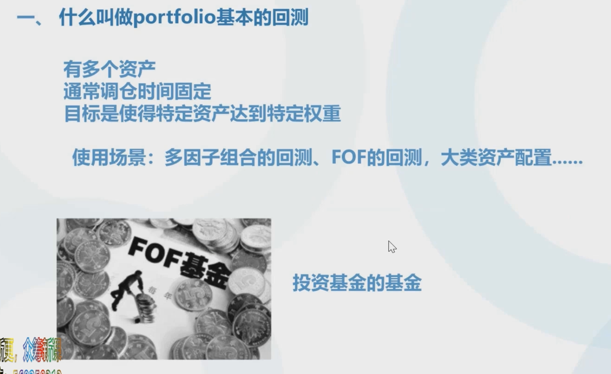
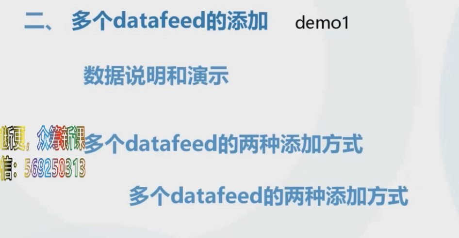
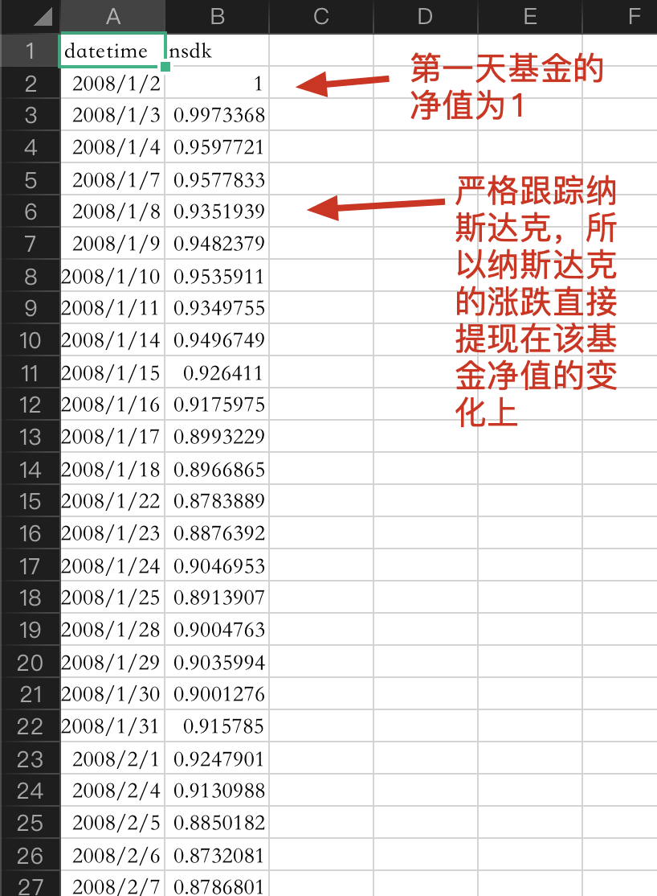
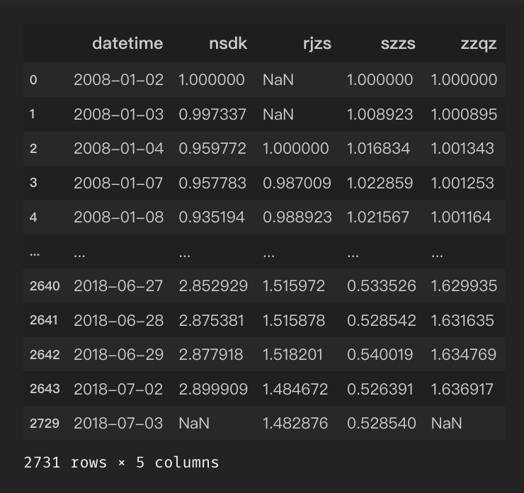
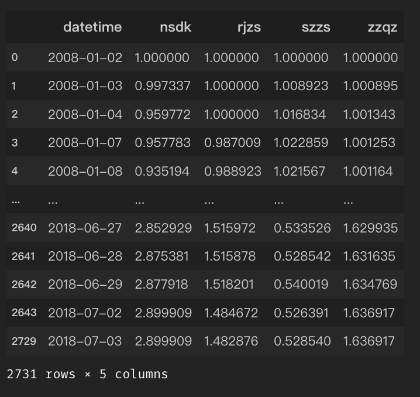
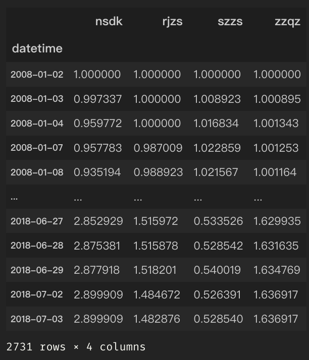
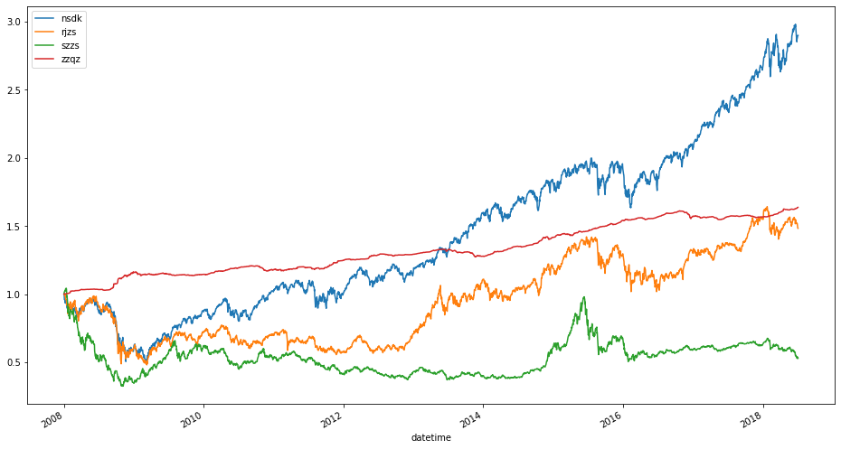
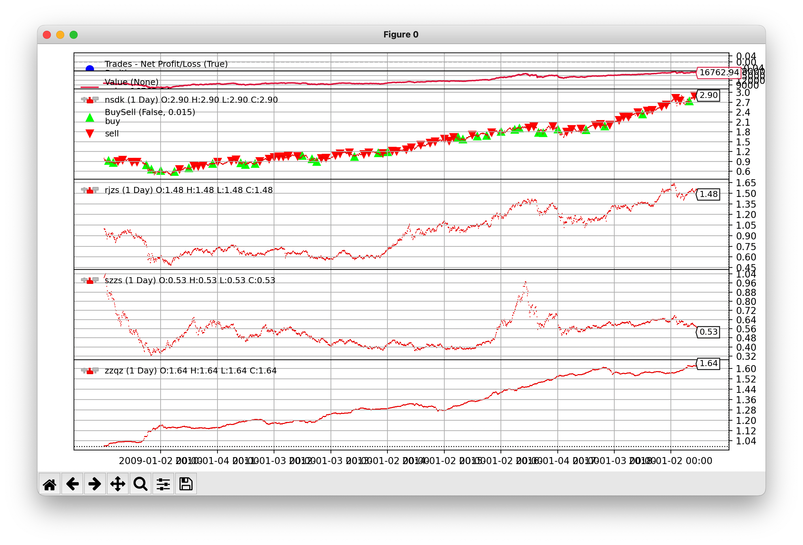

## 第六章 Portfolio级别的回测-以FOF为例



FOF就是投资基金的基金。

### 1. 数据清洗



这里是用四个数据：

- nsdk.csv：纳斯达克指数，这里可以理解为一个严格跟踪纳斯达克的基金（数据见下图）；

  

- rjzs.csv：日经指数

- szzs.csv：上证指数

- zzqz.csv：中证全债（债券指数），可以将其看做一堆债券，不会怎么亏。

既然使用不同的指数，那么就面临一个新问题：交易日不同。

思路：假设四个数据中某一个指数当天有数据，那么即使其他三个都停市，那么这三个市场的数据都使用之前一天的数据进行填充。

所以要进行数据预处理（在jupyter-notebook中）：

```python
%matplotlib inline
import pandas as pd

nsdk_df=pd.read_csv('data/nsdk.csv')
rjzs_df=pd.read_csv('data/rjzs.csv')
szzs_df=pd.read_csv('data/szzs.csv')
zzqz_df=pd.read_csv('data/zzqz.csv')

# outer合并四个数据
summary_df = pd.merge(nsdk_df, rjzs_df, on=['datetime'], how='outer').merge(
    szzs_df, on=['datetime'], how='outer').merge(zzqz_df, on=['datetime'], how='outer')

# datetime转时间格式
summary_df.datetime = pd.to_datetime(summary_df.datetime)

# 按照datetime排序
summary_df = summary_df.sort_values('datetime')
summary_df
```



```python
# 用前一天的value填充，如果是na的话。最后的2008-01-02~2008-01-03的na用1.0填充
summary_df = summary_df.fillna(method='ffill').fillna(1.0)
```



```python
summary_df.set_index('datetime', inplace=True)
summary_df
```



```python
summary_df.plot(figsize=(16,9))
```


```python
summary_df.plot(figsize=(16,9))
# 数据持久化
summary_df.to_hdf('processed_data.h5',key='data')
```



### 2. 股债平衡策略回测


该策略的好处：在牛市当中，不断的卖股票买债券（逃顶）；在熊市当中，不断地卖债券买股票（类似股票抄底的操作）。从宏观来看，收益是会跑赢大盘的。

一般来说，假设今年你30岁，那么初始资产分配就是买30%的债券和70%的股票。年纪大了，相对来说抗风险能力就弱了。

```python
import backtrader as bt
import pandas as pd
import datetime


class HalfHalfBalance(bt.Strategy):
    def __init__(self):
        pass

    def next(self):
        today = self.data.datetime.date()
        year, month = today.year, today.month
        # 月末balance，统计当月有几天
        if month == 12:
            this_month_length = (datetime.datetime(year + 1, 1, 1) - datetime.datetime(year, month, 1)).days
        else:
            # 当月共有几天
            this_month_length = (datetime.datetime(year, month + 1, 1) - datetime.datetime(year, month, 1)).days
        # 月末调仓
        if today.day == this_month_length:
            # 将目标datafeed买入到你希望的占比
            # 将美股买入总资金的30%
            self.order_target_percent(target=0.3, data='nsdk')
            # 日经
            self.order_target_percent(target=0.1, data='rjzs')
            # 上证（a股）
            self.order_target_percent(target=0.25, data='szzs')
            # 债券
            self.order_target_percent(target=0.25, data='zzqz')
            # 为什么总体百分比之和不是100%? 因为可能资金量不够。
            # 在实盘中不可能将资金全部打满，要预留一部分针对流动性问题的出现


# 关闭默认添加的observers
cerebro = bt.Cerebro(stdstats=False)
cerebro.addobserver(bt.observers.Trades)
cerebro.addobserver(bt.observers.BuySell)
cerebro.addobserver(bt.observers.Value)

# 读取预处理好的数据
total_df = pd.read_hdf('processed_data.h5', key='data')

# col_name为每种基金的名称
for col_name in total_df:
    # 不加copy()会出现warning
    df = total_df[[col_name]].copy()
    for col in ['open', 'high', 'low', 'close']:
        # 将ohlc都设置成当天该基金的净值
        df[col] = df[col_name]
        df['volume'] = 1000000000
        datafeed = bt.feeds.PandasData(dataname=df)
    cerebro.adddata(datafeed, name=col_name)

cerebro.addstrategy(HalfHalfBalance)
cerebro.run()
print('value: ', cerebro.broker.get_value())
# 绘图不显示volume
cerebro.plot(style='candle', volume=False)
```

从前十年的历史数据来看，a股和美股的相关性不高，但是日经和美股却存在一定的相关性。