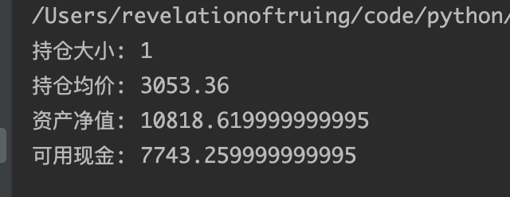

## 第四章 回测的设置

### 1. 手续费、滑点、保证金的设置


mult点数——股指期货一点是300元。

name用来指定这个规则适用于哪个datafeed。如果不指定，这个规则就适用于所有datafeed。

```python
cerebro.broker.setcommission(commission=2.0, margin=2000.0, mult=10.0)
```

表示该期货每一份合约手续费是2块，保证金是2000块，该期货一点是10元。

股票是没有保证金和点数的。

```python
import backtrader as bt
import pandas as pd
import datetime


class ThreeBars(bt.Indicator):
    # 本指标中有两个lines，上下轨，在此声明
    lines = ('up', 'down')

    def __init__(self):
        # 设定指标最小的周期，即第四个bar上才会有指标数值
        self.addminperiod(4)
        # 指标作图的时候是跟着哪个data走的（即本指标中的up和down将跟主图呈现在一起）
        # self.plotinfo.plotmaster = self.data

    def next(self):
        # 其实就是self.up[0]
        # .get(ago=-1, size=3)中，size表示取出3天的价格，ago表示从哪天开始取（-1表示从昨天开始），那么总的就是从昨天开始向前取3天的数据
        self.lines[0][0] = max(max(self.data.close.get(ago=-1, size=3)), max(self.data.open.get(ago=-1, size=3)))
        self.down[0] = min(min(self.data.close.get(ago=-1, size=3)), min(self.data.open.get(ago=-1, size=3)))


class MyStrategy(bt.Strategy):
    def __init__(self):
        self.up_down = ThreeBars(self.data)
        # 指标线与主图显示在一起
        self.up_down.plotinfo.plotmaster = self.data

        self.buy_signal = bt.indicators.CrossOver(self.data.close, self.up_down.up)
        self.sell_signal = bt.indicators.CrossDown(self.data.close, self.up_down.down)
        # 不在图中显示buy_signal和sell_signal的值
        self.buy_signal.plotinfo.plot = False
        self.sell_signal.plotinfo.plot = False

    def next(self):
        # 如果此时没有仓位并且出现买入信号
        if not self.position and self.buy_signal[0] == 1:
            self.order = self.buy()
        # 如果此时持空仓并且出现买入信号
        if self.getposition().size < 0 and self.buy_signal[0] == 1:
            self.order = self.close()  # 清掉仓位
            self.order = self.buy()

        # 如果此时没仓位并且出现卖出信号
        if not self.position and self.sell_signal[0] == 1:
            self.order = self.sell()

        # 如果此时持多仓并且出现卖出信号
        if self.getposition().size > 0 and self.sell_signal[0] == 1:
            self.order = self.close()  # 清掉仓位
            self.order = self.sell()


cerebro = bt.Cerebro()

# 读取数据的方法1
df = pd.read_csv('data/rbfi_day.csv')
df['datetime'] = pd.to_datetime(df['datetime'])
df.set_index('datetime', inplace=True)
df['openinterest'] = 0
# 注 能用pandas的地方尽量用pandas
# 将pandas的dateframe转换成cerebro能识别的数据形式
brf_daily = bt.feeds.PandasData(
    dataname=df,
    fromdate=datetime.datetime(2015, 5, 13),
    todate=datetime.datetime(2017, 6, 20)
)

# 添加datafeed时指定name
cerebro.adddata(brf_daily, name='brf')

cerebro.addstrategy(MyStrategy)

# 设置起始现金2w元
cerebro.broker.setcash(20000.0)
# 设置期货模式的手续费
cerebro.broker.setcommission(commission=2.0, margin=2000.0, name='brf')

# 设置股票模式的手续费
# cerebro.broker.setcommission(commission=0.005, name='brf')

cerebro.run()

# 曲线为蜡烛图
cerebro.plot(style='candle')
```


改成股票模式，手续费为万3：

```python
cerebro.broker.setcommission(commission=0.0003, name='brf')
```


滑点就是冲击成本。

cerebro.broker.set_slippage_fixed(fixed=5)，表示每一买单，都会多花5块钱；如果是卖单，都会少卖5块钱。即每一笔交易都会少10元（一买一卖）。

固定滑点：

cerebro.broker.set_slippage_fixed(fixed=5)


cerebro.broker.set_slippage_perc(perc=0.0005)


### 2. Filler设置和演示


假如说历史bar中的成交量很小，而回测是要下一个很大的单子，这很明显在实际中是无法做到的。所以需要将下单的总量做一个分摊的算法。

假如某根k线的成交量是100btc，设置fillers为FixedBarPerc(perc=0.1)后回测，在该历史bar上最多可以成交10%x100=10btc。如果超过了10btc，那么剩余的量会递延到下一根bar成交。

```python
...


class MyStrategy(bt.Strategy):
    
    ...

    def next(self):
        # 如果此时没有仓位并且出现买入信号
        if not self.position and self.buy_signal[0] == 1:
            # 买10手
            self.order = self.buy(size=10)


cerebro = bt.Cerebro()

# 读取数据的方法1
df = pd.read_csv('data/rbfi_day.csv')
df['datetime'] = pd.to_datetime(df['datetime'])
df.set_index('datetime', inplace=True)
df['openinterest'] = 0
# 注 能用pandas的地方尽量用pandas
# 将pandas的dateframe转换成cerebro能识别的数据形式
brf_daily = bt.feeds.PandasData(
    dataname=df,
    fromdate=datetime.datetime(2015, 5, 13),
    todate=datetime.datetime(2017, 6, 20)
)

# 添加datafeed时指定name
cerebro.adddata(brf_daily, name='brf')

cerebro.addstrategy(MyStrategy)

# 设置起始现金2w元
cerebro.broker.setcash(20000.0)
# 设置期货模式的手续费
# cerebro.broker.setcommission(commission=2.0, margin=2000.0, name='brf')

# 设置股票模式的手续费
cerebro.broker.setcommission(commission=0.0003, name='brf')
# 固定滑点
# cerebro.broker.set_slippage_fixed(fixed=5)
# 万5的滑点
cerebro.broker.set_slippage_perc(perc=0.0005)

# 设置filler
# cerebro.broker.set_filler(bt.broker.fillers.FixedBarPerc(perc=0.1))
# 固定size的filler，每根bar最多只能买1手
cerebro.broker.set_filler(bt.broker.fillers.FixedSize(size=1))

cerebro.run()

# 曲线为蜡烛图
cerebro.plot(style='candle')

```


### 3. Writer的使用


writer用于将当时回测的一些信息都记录下来。

```python
...

cerebro = bt.Cerebro()

df = pd.read_csv('data/rbfi_day.csv')
df['datetime'] = pd.to_datetime(df['datetime'])
df.set_index('datetime', inplace=True)
df['openinterest'] = 0

brf_daily = bt.feeds.PandasData(
    dataname=df,
    fromdate=datetime.datetime(2015, 5, 13),
    todate=datetime.datetime(2017, 6, 20)
)

cerebro.adddata(brf_daily, name='brf')

cerebro.addstrategy(MyStrategy)

cerebro.addanalyzer(bt.analyzers.DrawDown)
cerebro.addanalyzer(bt.analyzers.TradeAnalyzer)

# 添加writer，输出为一个csv文件
cerebro.addwriter(bt.WriterFile, csv=True, out='backtest_result.csv')

cerebro.run()

cerebro.plot(style='candle')

```

运行后，在同级目录下会产生一个backtest_result.csv文件：


用excel打开该文件：


可以看到很多策略的信息即回测的信息都在其中：


加入observers：

```python
cerebro = bt.Cerebro()

# 添加一个observer——TimeReturn，用于记录每日的收益
cerebro.addobserver(bt.observers.TimeReturn)

# 读取数据的方法1
df = pd.read_csv('data/rbfi_day.csv')
df['datetime'] = pd.to_datetime(df['datetime'])
df.set_index('datetime', inplace=True)
df['openinterest'] = 0
# 注 能用pandas的地方尽量用pandas
# 将pandas的dateframe转换成cerebro能识别的数据形式
brf_daily = bt.feeds.PandasData(
    dataname=df,
    fromdate=datetime.datetime(2015, 5, 13),
    todate=datetime.datetime(2017, 6, 20)
)

# 添加datafeed时指定name
cerebro.adddata(brf_daily, name='brf')

cerebro.addstrategy(MyStrategy)

cerebro.addanalyzer(bt.analyzers.DrawDown)
cerebro.addanalyzer(bt.analyzers.TradeAnalyzer)

# 添加writer，输出为一个csv文件
cerebro.addwriter(bt.WriterFile, csv=True, out='backtest_result.csv')

cerebro.run()

# 曲线为蜡烛图
cerebro.plot(style='candle')

```

运行后打开生成的csv文件：


所以，添加的observer（即每根bar都会统计出一个数据）会在每日数据后面追加。而analyzer会在输出csv文件的最后输出。

### 4. Broker的get方法

就是向你的broker去询问你当前的资产或净值还有多少：


```python
cerebro = bt.Cerebro()

cerebro.addobserver(bt.observers.TimeReturn)

df = pd.read_csv('data/rbfi_day.csv')
df['datetime'] = pd.to_datetime(df['datetime'])
df.set_index('datetime', inplace=True)
df['openinterest'] = 0

brf_daily = bt.feeds.PandasData(
    dataname=df,
    fromdate=datetime.datetime(2015, 5, 13),
    todate=datetime.datetime(2017, 6, 20)
)

cerebro.adddata(brf_daily, name='brf')

cerebro.addstrategy(MyStrategy)

cerebro.run()

# 查看仓位信息
pos = cerebro.broker.getposition(brf_daily)
print(f'持仓大小: {pos.size}')
print(f'持仓均价: {pos.price}')
print(f'资产净值: {cerebro.broker.get_value()}')
print(f'可用现金: {cerebro.broker.get_cash()}')
```


